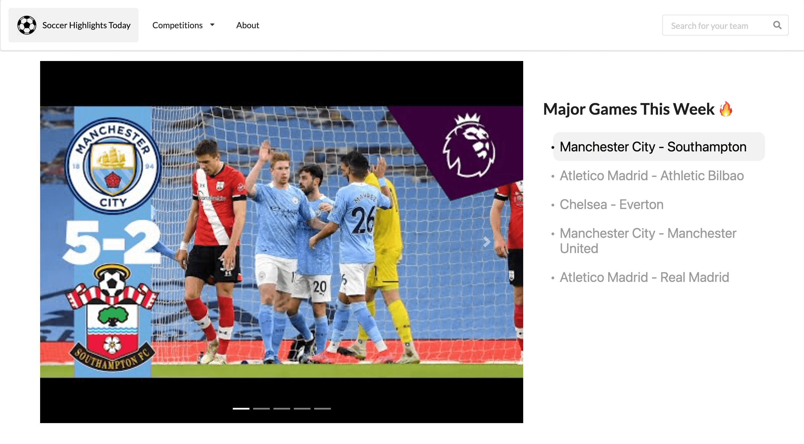
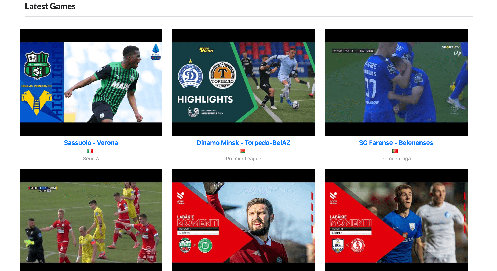
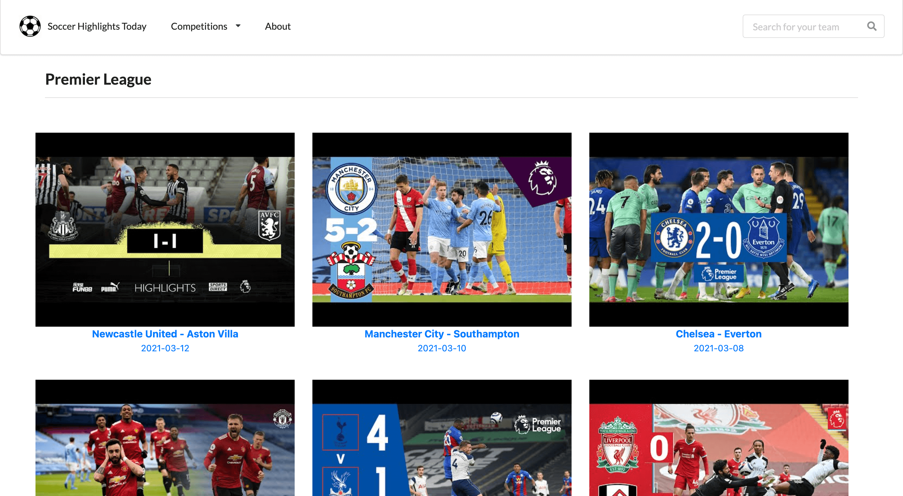
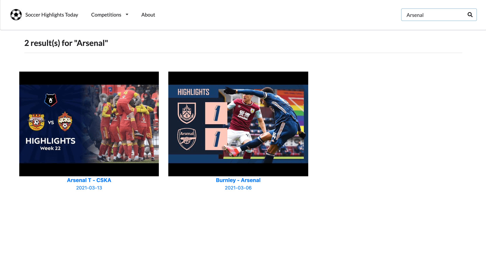
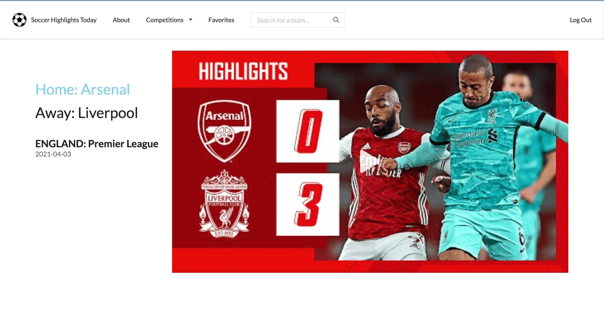
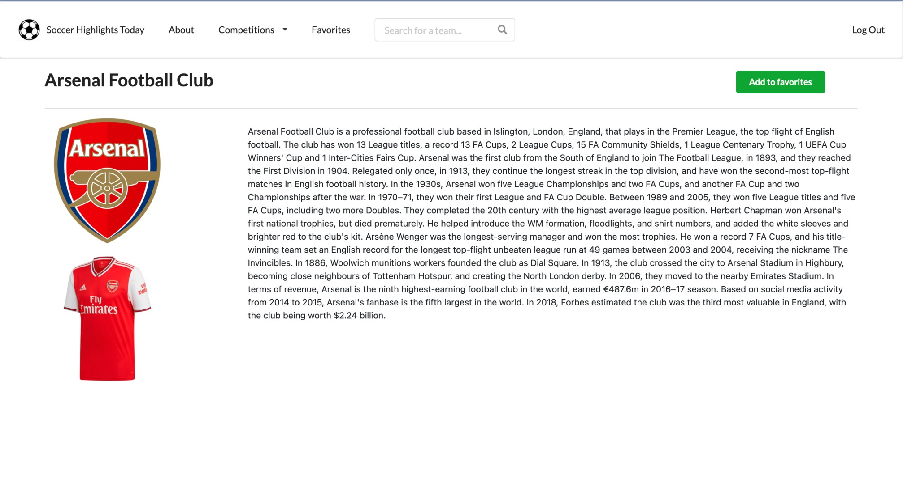
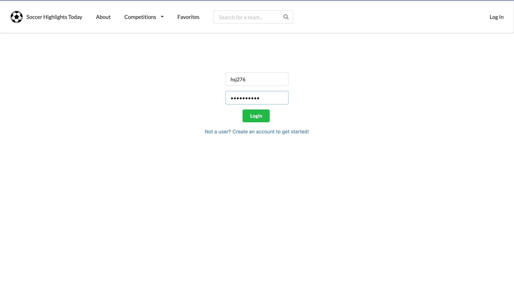
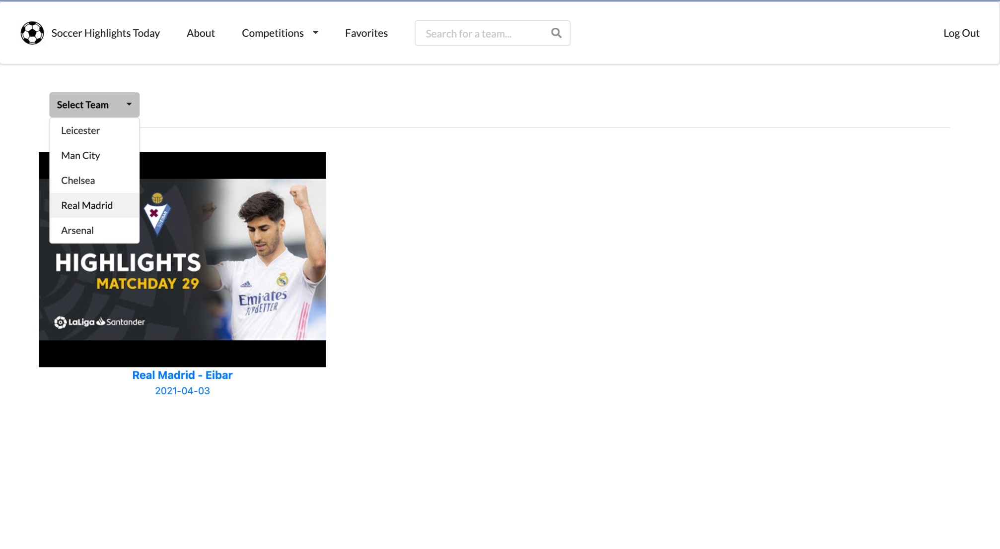

# Soccer Highlights Today

A single-page web application that displays world's latest professional football highlights using open-souce API from [scorebat](https://www.scorebat.com/video-api). Users can also search by competitions or teams.

## Todo

-   Deployment

## Usage

To Clone this project,

```
$ git clone https://github.com/DanielJang99/soccer_highlights_today.git
```

Once you have cloned and changed the directory to the project, run following commands.

```
cd frontend
npm run start:dev


# ON A SEPARATE TERMINAL SESSION
cd server
npm run dev
```

The open `http://localhost:3000`

## Built With

-   [Next.js](https://nextjs.org/) as React Framework
-   [Vercel](https://vercel.com/dashboard) for deployment
-   [Semantic UI React](https://react.semantic-ui.com/) and [React-BootStrap](https://react-bootstrap.github.io/) for styling
-   [Scorebat](https://www.scorebat.com/video-api) for highlights api
-   [SportsDB](https://www.thesportsdb.com/api.php) for team information api
-   MongoDb for database
-   Next.JS for backend

## Site

**Landing Page**

Displays 5 latest game highlights of [14 UEFA teams with highest club coefficients ](https://www.uefa.com/memberassociations/uefarankings/club/#/yr/2021) in the carousel. Data fetched by _static generation_ for performance.  


Displays latest highlights fetched from [scorebat api](https://www.scorebat.com/video-api).


**Competition Page**

Sorts latest game highlights by top 4 UEFA leagues: Premier League, La Liga, Bundesliga, Serie A. Data fetched by _static generation_ for performance.


**Search Page**

Displays latest game highlights of the team searched by the user. Data fetched by _server-side rendering_ for up-to-date data.


**Match Page**

Displays the match highlight embedded. Users can click the name of the teams to move on the team page.


**Team Page**

Displays team information obtained from [SportsDB](https://www.thesportsdb.com/api.php). Logged-in users can add their favorite teams.


**Login Page**

Allows user to login or to create a new account. All passwords are hashed with bcrypt.


**Favorites Page**

Allows logged-in users to view highlights of teams they have added to favorites.

