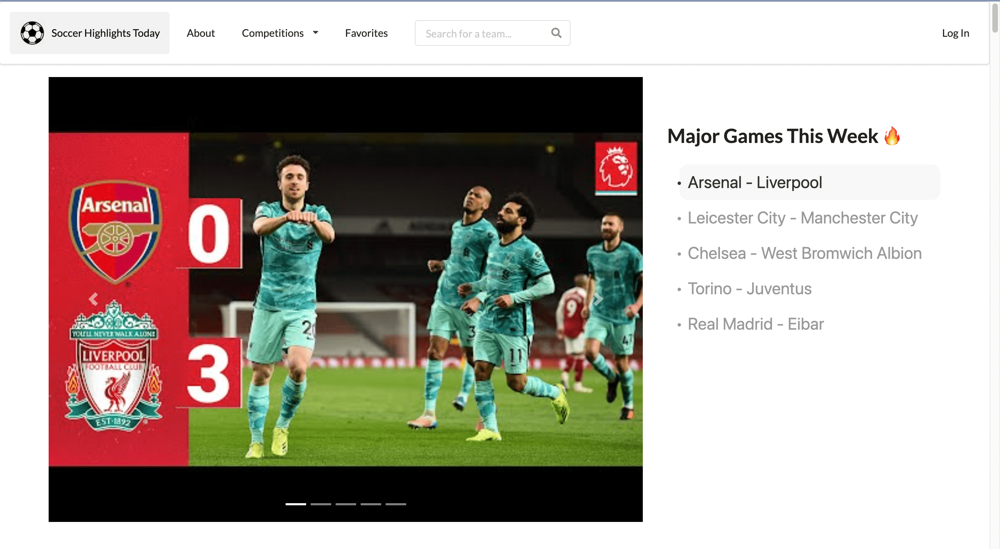
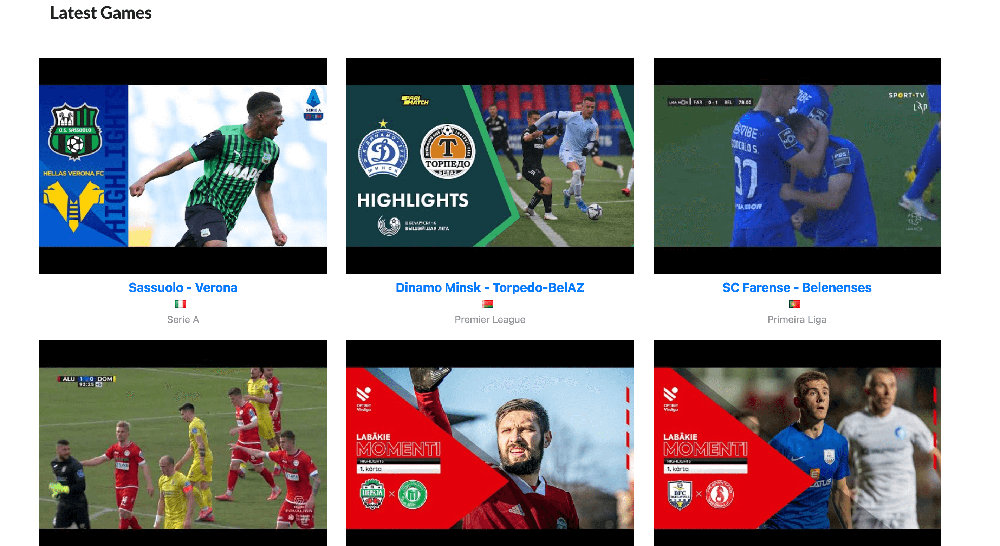
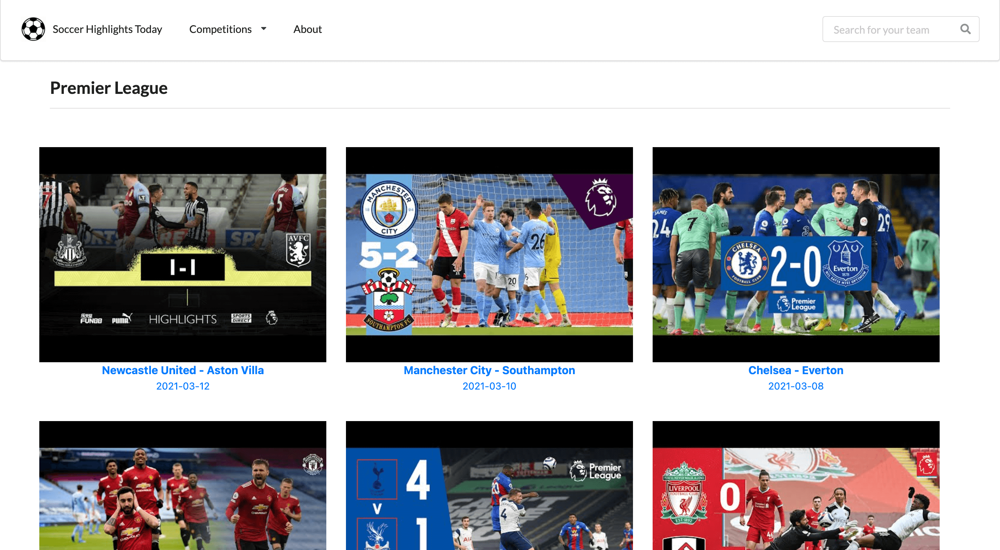
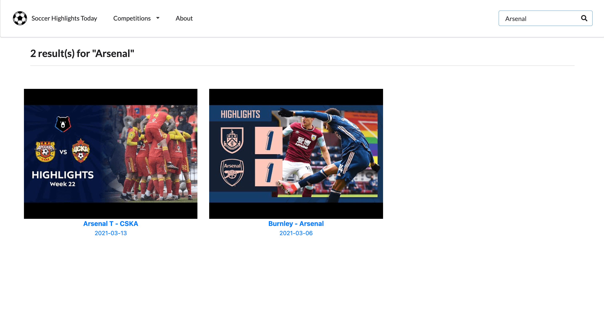

# Soccer Highlights Today

A single-page web application that displays world's latest professional football highlights using open-souce API from [scorebat](https://www.scorebat.com/video-api). Users can also search by competitions or teams.

## References

Here is a live-working demo: [Soccer Highlights Today](https://soccer-highlights-today.vercel.app/)

## Built With

-   [Next.js](https://nextjs.org/) as React Framework
-   [Vercel](https://vercel.com/dashboard) for deployment
-   [Semantic UI React](https://react.semantic-ui.com/) and [React-BootStrap](https://react-bootstrap.github.io/) for styling
-   [Scorebat](https://www.scorebat.com/video-api) for data

## Site

**Landing Page**

Displays 5 latest game highlights of [14 UEFA teams with highest club coefficients ](https://www.uefa.com/memberassociations/uefarankings/club/#/yr/2021) in the carousel. Data fetched by _static generation_ for performance.  

Displays latest highlights fetched from [scorebat api](https://www.scorebat.com/video-api).

**Competition Page**

Sorts latest game highlights by top 4 UEFA leagues: Premier League, La Liga, Bundesliga, Serie A. Data fetched by _static generation_ for performance.

**Search Page**

Displays latest game highlights of the team searched by the user. Data fetched by _server-side rendering_ for up-to-date data.

## Todo

-   Login feature for users
-   Storing games for particular teams selected by a user
